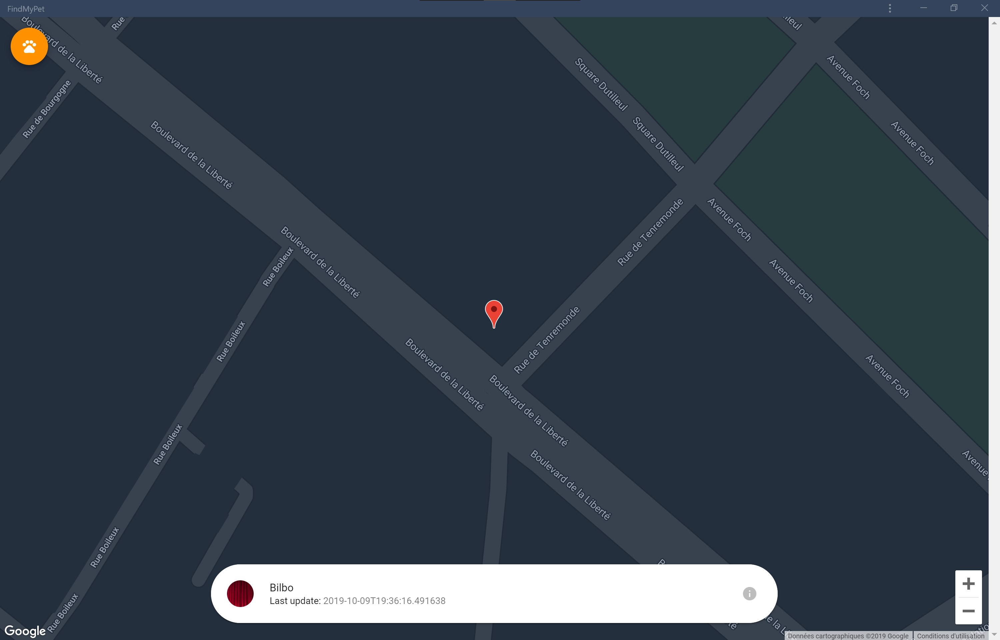
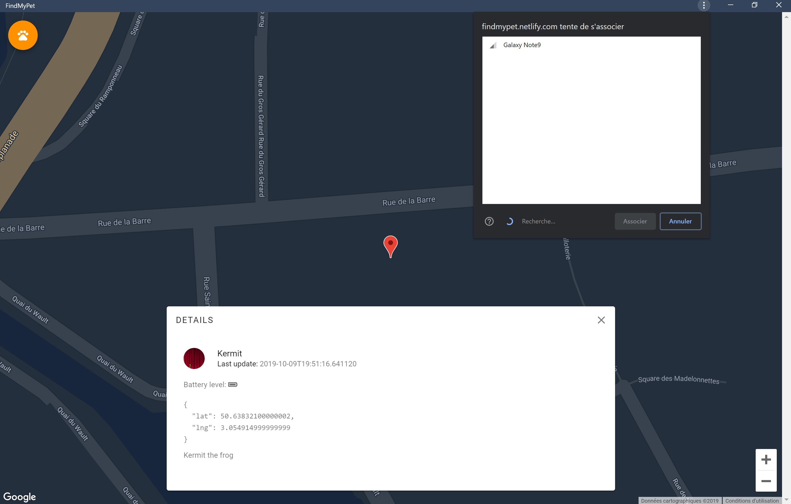

# FindMyPet


Demo: [FindMyPet](https://www.30millionsdamis.fr/uploads/pics/conseils-erreurs-chat-1171.jpg)
> Invitation obligatoire

Backend: [enginma_findmypet_backend](https://github.com/averdier/enigma_findmypet_backend)

Design: [présentation](./docs/desgin.pptx)

Bienvenue sur **FindMyPet**, la première application de géolocalisation des vos animaux avec des puces de traçage à très grande autonomie. **FindMyPet** utilise les technologies SIGFox et Bluetooth 5 afin de posséder un des meilleurs réseau de couverture, mais surtout, une des technologie les moins énergivore du marché.

## Statut

[](https://app.netlify.com/sites/findmypet/deploys)

- [x] Service worker
- [x] Bluetooth
- [x] Notifications push
- [x] PWA
- [x] API
- [x] Lister les animaux
- [x] Créer un animal
- [] Editer un animal
- [] Supprimer un animal

# Variables d'environnement

Quelques variables d'environnements sont disponibles afin de modeler l'application à votre convenance.

|NOM|DESCRIPTION|Exemple|
|----------------|-------------------------------|-----------------------------|
|VUE_APP_NAME|Nom d'affichage de l'application|FindMyPet|
|VUE_APP_BASE_URL|Chemin d'accès relatif à l'application front|"/app"|
|VUE_APP_PUSH_SERVER_KEY|Clé pour les notifications push|BDl0cLpGC_-qNSrk-jbT0|
|VUE_APP_BACKEND|Adresse du WebService REST|https://fgmzkcbaka.execute-api.eu-central-1.amazonaws.com/dev/api|
|VUE_APP_AUTH_ISSUER|Identifiant du fournisseur de l'identité OIDC|https://cognito-idp.eu-central-1.amazonaws.com/eu-central-1_4Q91wIB8X|
|VUE_APP_AUTH_BACKEND|Adresse de base pour les actions OIDC|https://rastadev.auth.eu-central-1.amazoncognito.com|
|VUE_APP_AUTH_ID|Identifiant unique pour le client OIDC|5cceqh6ihehe2121r6k9nbu5r **(fake value)**|
|VUE_APP_AUTH_SECRET|Mot de passe pour le client OIDC|e2jg7up9vp4hei68jcondq8t9gpk **(fake value)**|
|VUE_APP_AUTH_LOGIN_CALLBACK|Adresse de callback pour l'action de connexion|https://findmypet.netlify.com/oidc/login
|VUE_APP_AUTH_LOGOUT_CALLBACK|Adresse de callback pour l'action de déconnexion|https://findmypet.netlify.com/oidc/logout|

## Utilisation


> Page de connexion : Lors de la souscription à notre service, vous avez du recevoir par email vos identifiants. Ceux-ci seront stockés sur le téléphone pour une durée de 30 jours


> Demande de connexion : Lorsque vous accédez à l'application en étant deconnecté 


> Vue initiale



> Vue rapide d'un animal : Apparaissant en cliquant sur la puce de position d'un animal, cette fenêtre permet de savoir quel est l'animal qui se situe à cet endroit


> Vue détaillée d'un animal : En cliquant sur le petit point d'exclamation tout à droite de la vue rapide d'un animal, des détails apparaîtront sur lui (Position exacte, batterie etc)



> Lecture du niveau de batterie d'un appareil BLE (test possible sous Android à l'aide de l'application [BLE Peripheral Simulator App](https://play.google.com/store/apps/details?id=io.github.webbluetoothcg.bletestperipheral))


> Menu ouvert : les actions permettent respectivement : De fermer le menu, lister ses animaux, en créer un nouveau, avoir des informations sur l'équipe puis se déconnecter


> Listing de vos animaux, avec vue centrée sur la position moyenne de vos animaux


> Vue de création d'un animal : Permet de rajouter un nouvel animal à note collection. Sérial correspond à l'identifiant unique de sa puce


> Paramètres de l'application


> A propos de nous


> Notification push

## Installation
```
npm install
```

### Developpemnt
```
npm run serve
```

### Production
```
npm run build
```
